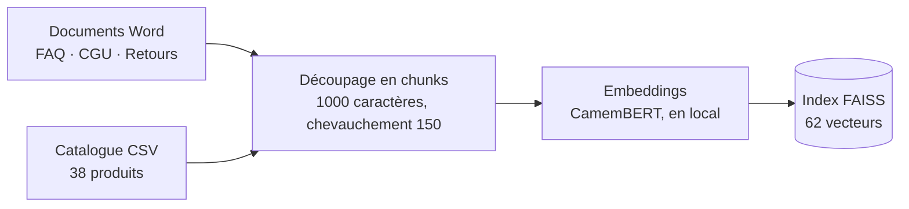
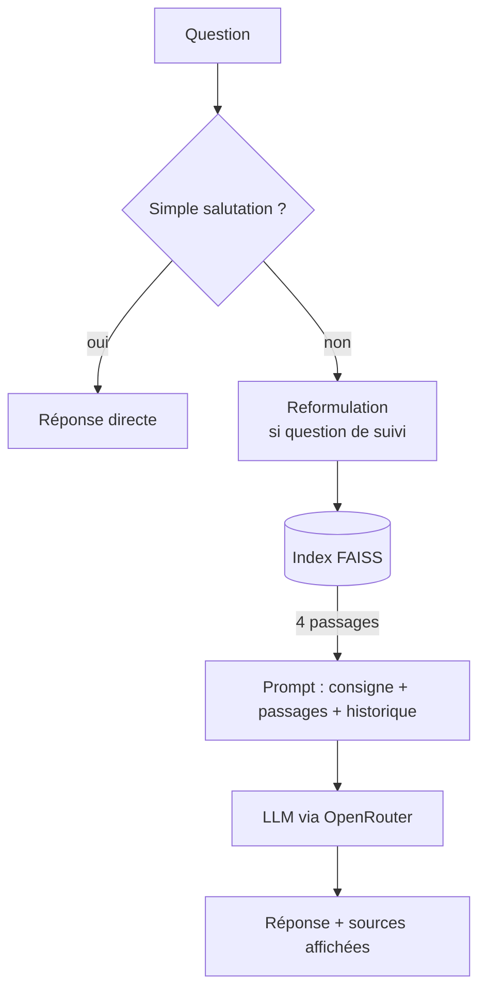

# NeoGarden Assistant

Assistant conversationnel (RAG) pour une boutique de jardinage fictive. Il répond en français aux questions sur les produits, la livraison, le paiement, les retours et les garanties, **uniquement à partir des documents de la boutique**, et montre les passages qui fondent chaque réponse.

> Projet de démonstration : la boutique, ses documents et ses marques sont fictifs.
> Le dépôt est en cours de restructuration en dépôt professionnel : voir la [feuille de route](#feuille-de-route). Il n'y a pas encore de tests automatisés, d'évaluation chiffrée ni d'intégration continue.

## Ce que fait l'assistant

- **Répond à partir de quatre sources** : FAQ, CGU, politique de retour et catalogue (38 produits).
- **Affiche ses sources** : les extraits utilisés sont visibles sous chaque réponse.
- **Suit la conversation** : une question de suivi comme « Et combien ça coûte ? » est d'abord reformulée en question autonome avant la recherche.
- **Refuse de répondre quand l'information manque**, au lieu d'inventer.
- **Répond directement aux salutations**, sans recherche.

Extrait d'une conversation réelle :

```
Vous       : Livrez-vous en Belgique ?
Assistant  : Oui, nous livrons en Belgique. (…)
Vous       : Et combien ça coûte ?
Assistant  : Pour la Belgique, la livraison coûte 9,90 € et devient gratuite à partir de 99 € d'achat.
Vous       : Quel est votre chiffre d'affaires 2025 ?
Assistant  : Je ne dispose pas de cette information dans le contexte fourni. (…)
```

## Comment ça marche

**Préparation (une fois, puis mise en cache sur disque)**



**À chaque question**



## Choix techniques

| Élément | Choix | Pourquoi |
|---|---|---|
| Approche | **RAG** (recherche + génération) | Les prix, conditions de livraison et de retour changent : on met à jour un document, pas un modèle. Chaque réponse est traçable jusqu'à ses sources. Un fine-tuning apprend un style ou un comportement, pas des faits qu'il faudrait réentraîner à chaque modification, et il ne cite pas ses sources. |
| Embeddings | `dangvantuan/sentence-camembert-base` | Modèle d'embeddings français (le corpus est en français), exécuté en local : pas de coût par requête. |
| Base vectorielle | FAISS, index sauvegardé sur disque | Sans serveur. L'index est recalculé automatiquement si les documents ou les paramètres changent (empreinte), sinon rechargé. |
| LLM | `nvidia/nemotron-3-super-120b-a12b:free` via OpenRouter | Modèle gratuit, fixé explicitement : le routage automatique d'OpenRouter pourrait choisir un modèle non conversationnel. |
| Découpage | 1000 caractères, chevauchement 150 | Valeurs par défaut, **non mesurées** (voir les limites). |
| Recherche | Top-4 par similarité vectorielle | Simple ; voir les limites. |
| Erreurs | Retry uniquement sur les erreurs temporaires | Réseau coupé, 429, 5xx : on réessaie. Clé invalide ou requête refusée : on ne réessaie pas. Un vrai bug n'est pas masqué. |

## Installation et lancement

Prérequis : Python 3.10 ou plus. L'installation télécharge PyTorch (plusieurs Go), et le premier lancement télécharge le modèle d'embeddings (plusieurs centaines de Mo), ensuite mis en cache.

```bash
python -m venv .venv
source .venv/bin/activate        # Windows : .venv\Scripts\activate
pip install -e .
cp .env.example .env             # Windows : copy .env.example .env
# puis renseigner OPENROUTER_API_KEY dans .env (clé : https://openrouter.ai/keys)
streamlit run app/streamlit_app.py
```

- **Windows** : `Lancer_NeoGarden.bat` lance l'application. Il utilise, dans l'ordre, la variable `NEOGARDEN_PYTHON` (chemin complet de `python.exe`), le dossier `.venv` du projet, puis le `python` du système.
- **Préparer l'index à l'avance** (par exemple avant une démo) : `python scripts/build_index.py`. L'option `--force` le reconstruit. L'index est écrit dans `vectorstore/`, ignoré par git.

## Configuration

Le seul secret est `OPENROUTER_API_KEY`, lu depuis le fichier `.env` (jamais versionné ; `.env.example` sert de modèle). Tous les autres réglages sont dans [`src/rag_garden/config.py`](src/rag_garden/config.py) : chemins, modèles, taille et chevauchement des chunks, nombre de passages retrouvés (`RETRIEVER_K`), nombre de tentatives en cas d'erreur temporaire.

## Structure du dépôt

```
neogarden-assistant/
├── app/streamlit_app.py       Interface : affichage uniquement
├── src/rag_garden/
│   ├── config.py              Réglages centralisés
│   ├── ingestion.py           Chargement des documents et découpage en chunks
│   ├── embeddings.py          Embeddings et index FAISS sauvegardé (avec empreinte)
│   ├── retriever.py           Recherche des passages (+ reformulation par l'historique)
│   ├── prompts.py             Consigne système et prompt de reformulation
│   ├── generation.py          Appel au LLM, retry sur erreurs temporaires
│   ├── memory.py              Historique de conversation au format LangChain
│   ├── guardrails.py          Raccourci « salutations » (autres garde-fous : prévus)
│   ├── errors.py              Erreurs métier
│   └── pipeline.py            Assemblage du RAG complet
├── scripts/build_index.py     Construit l'index FAISS à l'avance
├── data/                      Documents sources
├── docs/PLAN.md               Plan de restructuration, phase par phase
├── golden_set.csv             15 questions de test avec réponse et source attendues
├── LIMITES_RAG_EXEMPLES.md    Exemples concrets des limites du RAG
├── Lancer_NeoGarden.bat       Lanceur Windows
└── pyproject.toml, requirements.txt
```

## Données

Corpus fictif, en français :

| Source | Taille | Chunks |
|---|---|---|
| FAQ (`NeoGarden_FAQ.docx`) | 994 mots | 8 |
| CGU (`NeoGarden_CGU.docx`) | 1 218 mots | 9 |
| Politique de retour (`NeoGarden_Politique_Retour.docx`) | 927 mots | 7 |
| Catalogue (38 produits, 13 catégories) | une fiche par produit | 38 |
| **Total** | | **62** |

Les marques du catalogue (Verdania, Torvald, Aquaflow, BotaniK, Terraluxe, Ferroline, Solaris Garden, et la marque maison NeoGarden) sont inventées : attribuer des prix et des caractéristiques inventés à de vraies marques serait faux.

## Limites connues

Elles sont détaillées avec des cas réels dans [`LIMITES_RAG_EXEMPLES.md`](LIMITES_RAG_EXEMPLES.md) (par exemple : « peut-on payer en plusieurs fois ? » échoue alors que l'information existe).

1. **Recherche purement vectorielle, 4 passages fixes.** Pas de recherche par mots-clés (BM25) ni de reranker : les références exactes et les questions qui croisent deux sources sont mal servies, et une reformulation de la même question peut changer les passages retrouvés.
2. **Découpage non mesuré.** Un passage court peut être dilué par ses voisins dans un même chunk.
3. **Aucun garde-fou** : ni détection d'injection de prompt, ni filtre de questions hors sujet, ni contrôle que la réponse est ancrée dans le contexte.
4. **Aucun suivi** des tokens, de la latence ni du coût par requête.
5. Les sources s'affichent **même quand l'assistant refuse** de répondre.

Déjà traitées depuis la première version : l'historique de conversation dans la recherche, l'index sauvegardé sur disque, et un cache qui ne dépend plus de la clé API.

**Défauts identifiés, correction planifiée** (voir [`docs/PLAN.md`](docs/PLAN.md)) :
- « Bonjour ! » (avec l'espace avant le point d'exclamation) n'est pas reconnu comme une salutation et passe par la recherche. Correction en Phase 4, en écrivant d'abord le test.
- Le prompt système fusionne ses règles 3 et 4 sur une même ligne (saut de ligne manquant). Correction en Phase 5, après avoir mesuré l'effet du changement.

## Feuille de route

Le détail est dans [`docs/PLAN.md`](docs/PLAN.md). Une branche et une revue par phase.

| Phase | Contenu | État |
|---|---|---|
| 1 | Hygiène du dépôt : `.env.example`, `.gitignore`, configuration centralisée | ✅ |
| 2 | Découpage en modules, index persistant, erreurs précises | ✅ |
| 3 | Qualité : versions figées, Ruff, pre-commit | à venir |
| 4 | Tests unitaires (sans appel à l'API) | à venir |
| 5 | Évaluation : retrieval et génération, LLM-as-a-judge | à venir |
| 5bis | Garde-fous, mesurés avec l'évaluation | à venir |
| 6 | Intégration continue (GitHub Actions) | à venir |
| 7 | Documentation finale et résultats chiffrés | à venir |
